# Treinamento HTML - Suporte

## Slide 1

Treinamento
HTML
(Suporte)

Outubro

## Slide 2

Visão geral Arquitetura

Componentes

Análise de Erros

Objetivo

## Slide 3

AGENDA

Desenvolvimento HTML

Manutenção/Expedição FrontEnd/BackEnd

Requisição

Ferramentas

I

II

III

IV

V

Dicas

Análise de Erros

VI

## Slide 4

01

Desenvolvimento
HTML

## Slide 5

DESENVOLVIMENTO HTML

Apresentação

Desenvolvimento em Camadas:

FrontEnd

BackEnd

## Slide 6

DESENVOLVIMENTO HTML

Apresentação

- Desenha Tela
- Componentes

- Controle da Tela
- Pequenas Validações
- Chamada Serviços

- Fachada
- API-REST
- API/DBO

## Slide 7

02

Requisição

## Slide 8

REQUISIÇÃO

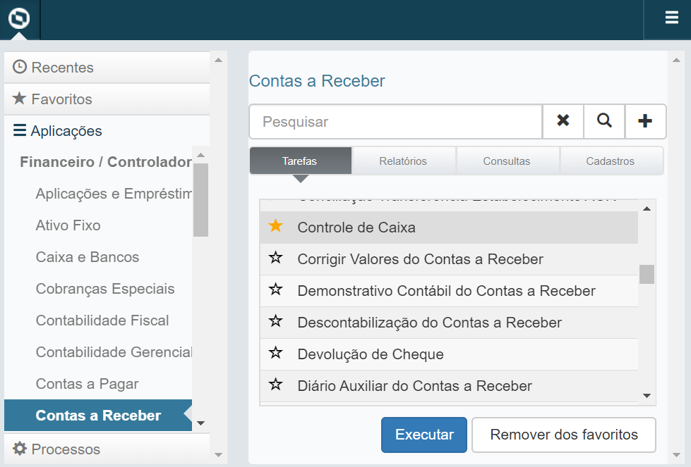

Fluxo da Informação:

1

2

Menu => Nome Externo
Projeto + Nome Tela

HTML + Arquivo de Controle (TS)

## Slide 9

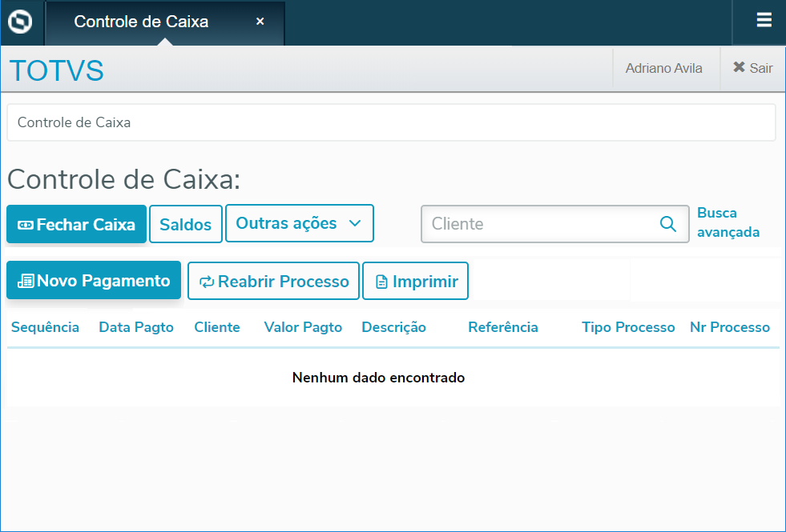

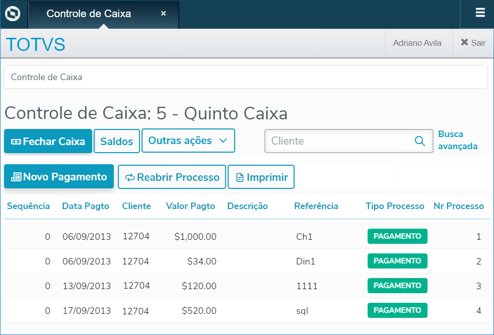

REQUISIÇÃO

Fluxo da Informação:

Serviço + Parâmetros

3

2

Programa Progress

Dados

Dados

1

4

Não roda Progress na máquina do usuário

## Slide 10

REQUISIÇÃO

Objetivo:

Mensagem

Mensagem: 
1) URL;
2) Método;
3) Corpo (envio/receb);
4) Código de Resposta.

Mensagem

## Slide 11

REQUISIÇÃO

Mensagem - 1) URL:

URL: 
http://servidor:porta/dts/datasul-rest/resources/prg/área/versão/programa

Exemplos: 
http://vigia:8480/dts/datasul-rest/resources/prg/fin/v1/customer?group=10

http://vigia:8480/dts/datasul-rest/resources/prg/man/v1/machines/1/relation

## Slide 12

REQUISIÇÃO

Mensagem - 1) URL - Programa:

http://vigia:8480/dts/datasul-rest/resources/prg/fin/v1/customer

Fachada (THF1)
ou
PRÉ-API-REST (PO-UI)

fin/api/v1/customer.p

Fixo (PO-UI)

## Slide 13

REQUISIÇÃO

Mensagem - 1) URL - Parâmetros:

URL: 
dts/datasul-rest/resources/prg/fin/v1/customer/1?fields=code,name&orderBy=name

dts/datasul-rest/resources/prg/fin/v1/accountReceivableDocument/49/executePayment

Tipos de Parâmetros:

PathParam:
Logo de depois do Programa;
Os parâmetros são separados por “/”;
Pode indicar um código ou uma Ação de Negócio.

## Slide 14

REQUISIÇÃO

Mensagem - 1) URL - Parâmetros:

URL: 
dts/datasul-rest/resources/prg/fin/v1/customer/1?fields=code,name&orderBy=name

dts/datasul-rest/resources/prg/fin/v1/accountReceivableDocument/49/executePayment

Tipos de Parâmetros:

QueryParam:
Utiliza o caracter “?” para separar do PathParam;
Os parâmetros são separados por “&”;
Pode indicar filtros ou parâmetros adicionais;
Formato por: chave + valor.

## Slide 15

REQUISIÇÃO

Mensagem - 2) Método:

Indica o Tipo de Ação que deve ser executada no BackEnd;
É uma convenção de Mercado;
Principais:

Exemplos - 1:
GET dts/datasul-rest/resources/prg/fin/v1/customer/1?fields=code,name&orderBy=name

POST dts/datasul-rest/resources/prg/fin/v1/accountReceivableDocument/49/executePayment

Regras
Exemplo:
Não deve mexer no banco de dados.

## Slide 16

REQUISIÇÃO

Mensagem - 2) Método:

Indica o Tipo de Ação que deve ser executada no BackEnd;
É uma convenção de Mercado;
Principais:

Exemplos - 2:
PUT dts/datasul-rest/resources/prg/fin/v1/customer/1

DELETE dts/datasul-rest/resources/prg/fin/v1/customer/1

Regras
Exemplo:
Não deve mexer no banco de dados.

## Slide 17

REQUISIÇÃO

Mensagem - 3) Corpo:

Envio: Informações necessário para execução do BackEnd;
Retorno: Informações de Retorno;
É opcional;
Na TOTVS utilizamos o formato “JSON” (chave + valor).

## Slide 18

REQUISIÇÃO

Mensagem - 3) Corpo - Exemplo:

POST dts/datasul-rest/resources/prg/fin/v1/customer

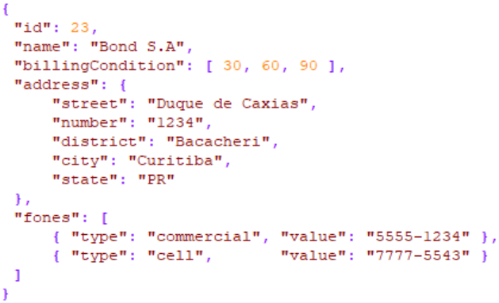

## Slide 19

REQUISIÇÃO

Mensagem - 4) Código de Resposta (Status Code):

Indica o que aconteceu no BackEnd;
É uma convenção de Mercado;
Faixas por Tipo:

## Slide 20

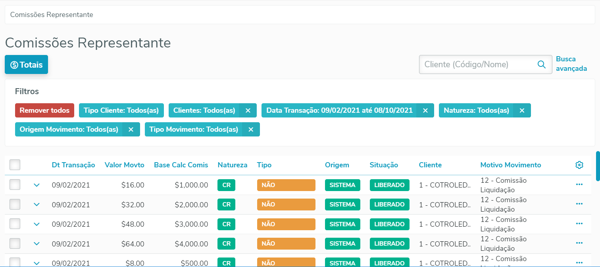

REQUISIÇÃO

Exemplo:

Filtros

Informações Retornadas

## Slide 21

REQUISIÇÃO

Exemplo:

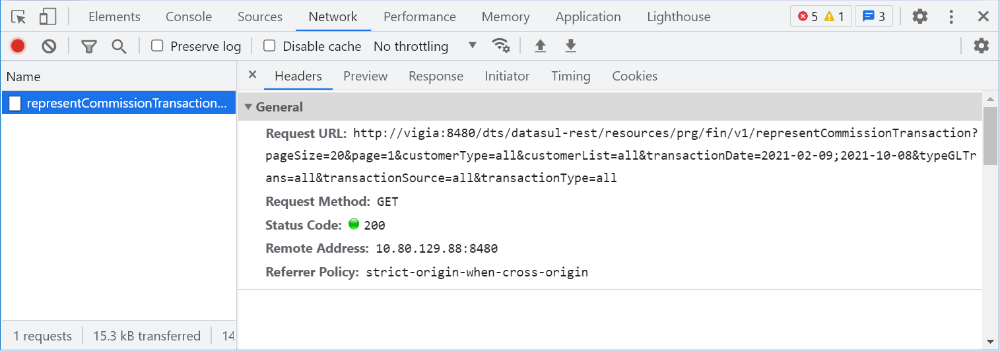

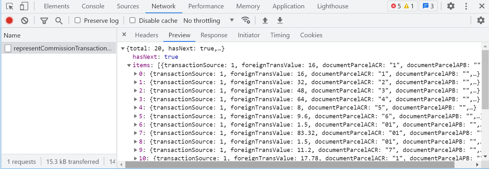

URL + Parâmetros

Método

Código de Resposta

Corpo da Resposta

## Slide 22

03

Manutenção/
Expedição
FrontEnd

## Slide 23

MANUTENÇÃO/EXPEDIÇÃO - FRONTEND

Fluxo da Manutenção:

1

2

Fontes Projeto

Fontes alterados

3

4

Fontes Projeto

Compilado Projeto

## Slide 24

MANUTENÇÃO/EXPEDIÇÃO - FRONTEND

É o “pacote” que vai para o ambiente;
É a menor parte “expedível”;
Padrão: HTML + Módulo; (Ex: html-acr-11.5.X-SNAPSHOT.war);
Portanto, a cada liberação é necessário expedir “todo o módulo”;
A versão é do Projeto e não dos programas;
A manutenção dos arquivos é individual;

Projeto HTML - Definição - THF1:

## Slide 25

MANUTENÇÃO/EXPEDIÇÃO - FRONTEND

Fonte Aberto;
Portanto é possível alterar os arquivos HTML e Javascript diretamente no ambiente;
Também, pode ser liberado os arquivos separadamente para o cliente;

Projeto HTML - Definição - THF1:

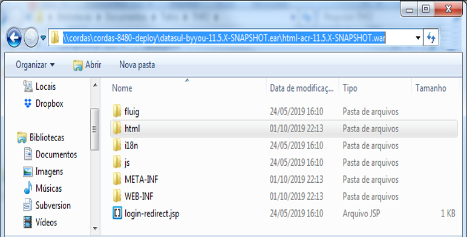

## Slide 26

MANUTENÇÃO/EXPEDIÇÃO - FRONTEND

É o “pacote” que vai para o ambiente;
É a menor parte “expedível”;
Padrões (definido pela equipe responsável): 
TOTVS + Área + Módulo (Ex: totvs-fin-acr.war);
TOTVS + Área + Funcionalidade (Ex: totvs-fis-calendario.war);
Portanto, a cada liberação é necessário expedir “todo o módulo ou funcionalidade”;
A versão é do Projeto e não dos programas;
A manutenção dos arquivos é individual;
O fonte é compilado;
Portanto, não há como liberar ou alterar apenas um arquivo no ambiente.

Projeto HTML - Definição - PO-UI:

## Slide 27

MANUTENÇÃO/EXPEDIÇÃO - FRONTEND

Os Fontes ficam no TFS, no caminho:
     $/Datasul/Fontes_Doc/Sustentacao/V11/V11/html

Projeto HTML - Fontes - THF1:

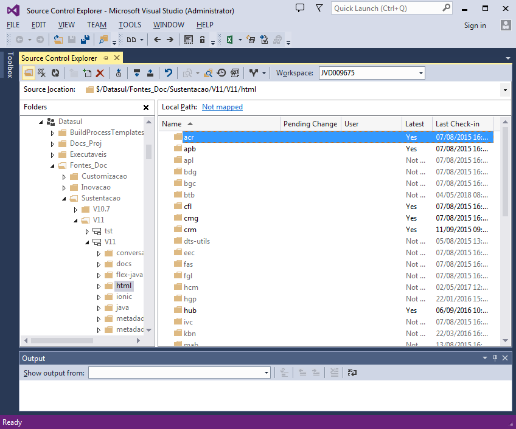

## Slide 28

MANUTENÇÃO/EXPEDIÇÃO - FRONTEND

Existem dois modelos de Desenvolvimento:

Projeto HTML - Fontes - PO-UI:

1) Modelo Atual: 
O gerenciamento de configuração do Projeto é de responsabilidade do GCAD;
Utiliza o mesmo repositório de fontes do Progress (TFS);
Local: $/Datasul/Fontes_Doc/Sustentacao/V11/V11/thf2

## Slide 29

MANUTENÇÃO/EXPEDIÇÃO - FRONTEND

Projeto HTML - Fontes - PO-UI:

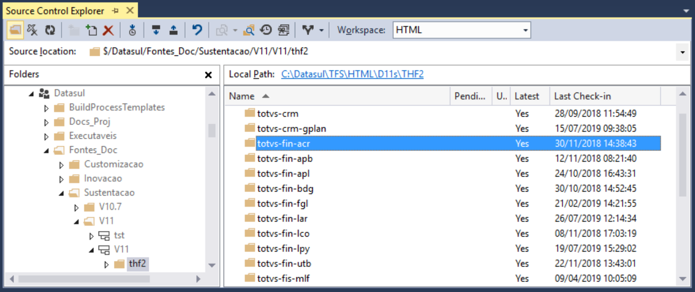

## Slide 30

MANUTENÇÃO/EXPEDIÇÃO - FRONTEND

Existem dois modelos de Desenvolvimento:

Projeto HTML - Fontes - PO-UI:

2) Novo Modelo (Devops): 
O gerenciamento de configuração do Projeto é de responsabilidade da Equipe;
Incorpora várias ferramentas de controle de aprovação de alteração, versionamento, teste unitário, validação de fonte, cobertura de código;
A proposta é que todos os projetos PO-UI sejam migrados para este modelo;
Ela está acontecendo aos poucos, conforme disponibilidade de cada equipe;
Utiliza como repositório o TFS1215 no modelo github;
Local: http://tfs2015.totvs.com.br:8080/tfs/CD-JV/

## Slide 31

MANUTENÇÃO/EXPEDIÇÃO - FRONTEND

Projeto HTML - Fontes - PO-UI:

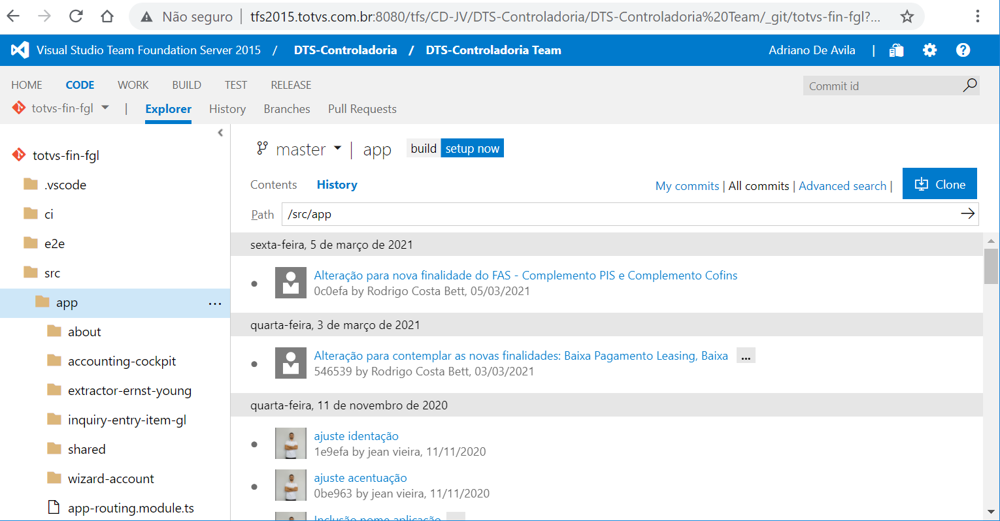

A permissão de acesso é definida pela equipe responsável pelo projeto

## Slide 32

MANUTENÇÃO/EXPEDIÇÃO - FRONTEND

Local: http://prado:8080/view/TODOS_HTML/

Projeto HTML - Integração Contínua - THF1:

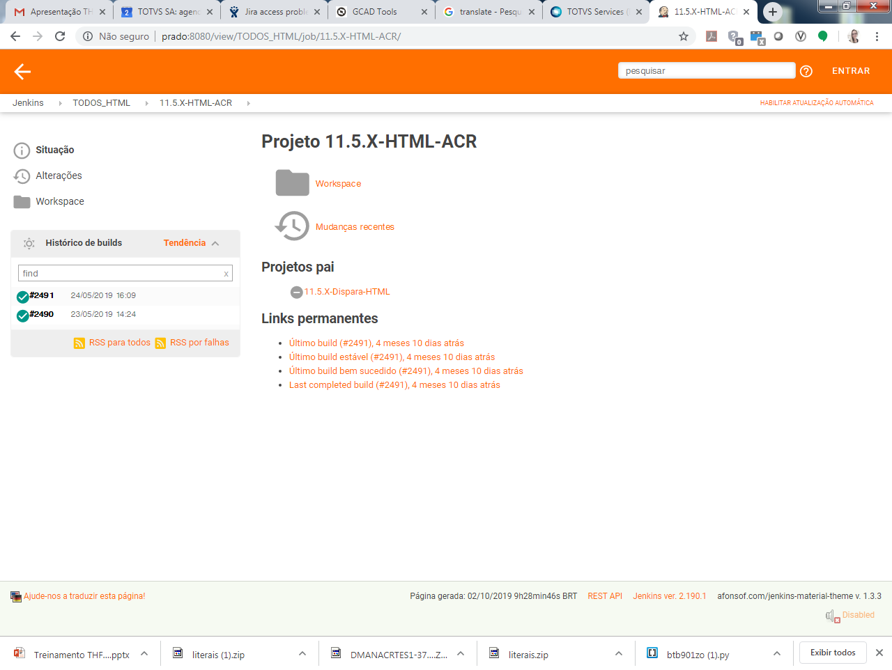

## Slide 33

MANUTENÇÃO/EXPEDIÇÃO - FRONTEND

Local: http://prado:8080/view/THF2/

Projeto HTML - Integração Contínua - PO-UI – Modelo Atual:

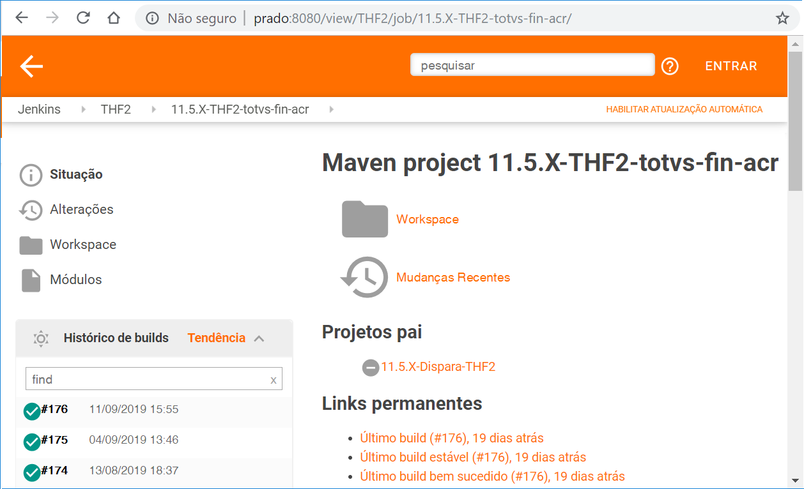

## Slide 34

MANUTENÇÃO/EXPEDIÇÃO - FRONTEND

Local: http://jenkins-gcad-ops.jv01.local/

Projeto HTML - Integração Contínua - PO-UI – Novo modelo:

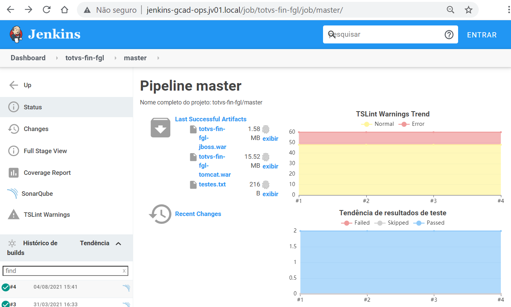

Ferramentas executadas no processo

## Slide 35

MANUTENÇÃO/EXPEDIÇÃO - FRONTEND

FONTES:
Não há um diretório de Fontes na rede - Somente TFS.

Projeto HTML:

COMPILADOS:
THF1: http://laranjeiras:8081/nexus/#view-repositories;repository-snapshots~browsestorage (Ex: com/totvs/html/html-acr)

PO-UI: http://porto:8081/#browse/browse:maven-snapshots (procurar pelo projeto, ex: totvs-fin-acr)

Para o novo Framework (Tomcat) os compilados também pode ser encontrados no caminho: \\laranjeiras\nfrw_repository\

## Slide 36

MANUTENÇÃO/EXPEDIÇÃO - FRONTEND

PATH DE LIBERAÇÃO:
Expedição via console;
Compilação realizada pela equipe;
Commit dos compilado no TFS: $/Patches_Datasul

Projeto HTML:

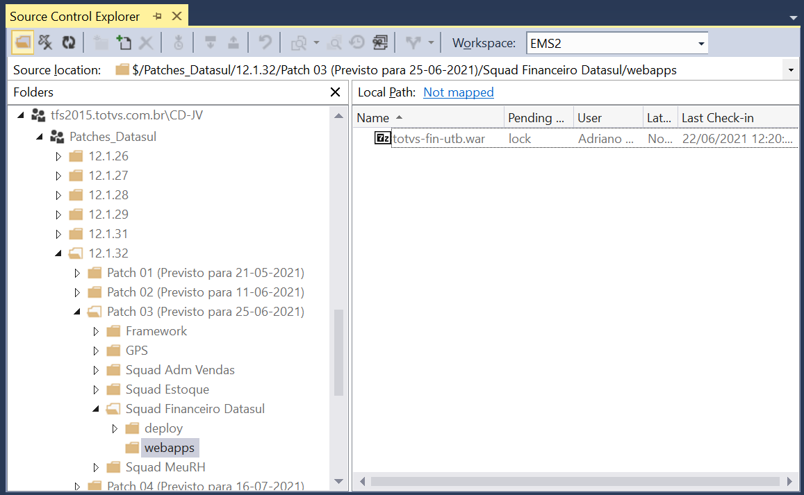

deploy - Jboss
webapps - Tomcat

## Slide 37

03

Manutenção/
Expedição
BackEnd

## Slide 38

MANUTENÇÃO/EXPEDIÇÃO - BACKEND

Manutenção/Compilação/Expedição:
Não muda nada em relação ao outros programas do produto.

Programas:
THF1 - Fachada + DBO/API de Negócio;
PO-UI - PRÉ-API-REST + API-REST + DBO/API de Negócio.

Programas:

## Slide 39

MANUTENÇÃO/EXPEDIÇÃO - BACKEND

Programas:

PRE-API-REST
(PO-UI)

Fachada (THF1)
API-REST (PO-UI)

API-NEGÓCIO
OU BO

## Slide 40

MANUTENÇÃO/EXPEDIÇÃO - BACKEND

Programas:

PRE-API-REST
(PO-UI)

Fachada (THF1)
API-REST (PO-UI)

API-NEGÓCIO
OU BO

Nome:
área/api/versão/entidade.p
Objetivo:
Porta de Entrada;
Controle de Versionamento;
Roteamento;
Executar a API-REST.

## Slide 41

MANUTENÇÃO/EXPEDIÇÃO - BACKEND

Programas:

PRE-API-REST
(PO-UI)

Fachada (THF1)
API-REST (PO-UI)

API-NEGÓCIO
OU BO

Nome:
área/api/versão/entidade.p
Objetivo:
Porta de Entrada;
Controle de Versionamento;
Roteamento;
Executar a API-REST.

Nome: 
THF1: fch/área/fch<seq>.p
PO-UI: área+api/apiEntidade.p
Objetivo:
Pegar os Parâmetros;
Transformação;
Controle dados retornados;
Pequenas lógicas de negócio;
Executar a API/BO de Negócio.

## Slide 42

MANUTENÇÃO/EXPEDIÇÃO - BACKEND

Programas:

PRE-API-REST
(PO-UI)

Fachada (THF1)
API-REST (PO-UI)

API-NEGÓCIO
OU BO

Nome:
área/api/versão/entidade.p
Objetivo:
Porta de Entrada;
Controle de Versionamento;
Roteamento;
Executar a API-REST.

Nome: 
THF1: fch/área/fch<seq>.p
PO-UI: área+api/apiEntidade.p
Objetivo:
Pegar os Parâmetros;
Transformação;
Controle dados retornados;
Pequenas lógicas de negócio;
Executar a API/BO de Negócio.

Objetivo:
Regra de Negócio;
CRUD.

## Slide 43

MANUTENÇÃO/EXPEDIÇÃO - BACKEND

Programas:

Exemplo:

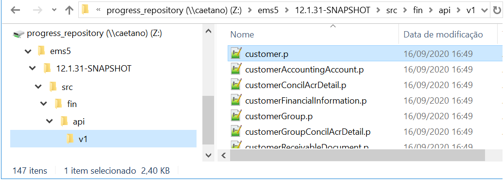

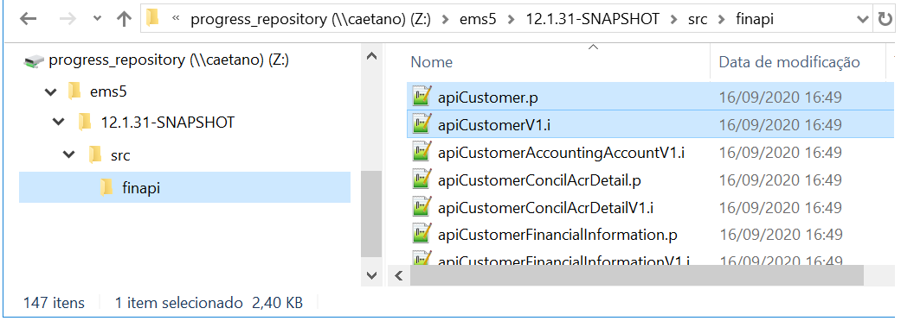

PRÉ-API-REST

API-REST

Com base nos parâmetros verifica se é uma Consulta, Alteração, Execução de Processo

Converte os Parâmetros e Dados e chama a API/DBO de negócio

## Slide 44

MANUTENÇÃO/EXPEDIÇÃO - BACKEND

1) Internas:
Utilizadas somente pelas telas internas do Produto;
Não possui documentação;
Podem ser alteradas a qualquer momento, alterando a estrutura se necessário;
Exemplo: finapi\v1\businessUnit.p - finapi\apiBusinessUnit.p

Programas:

Existem dois tipos de API-REST:

## Slide 45

MANUTENÇÃO/EXPEDIÇÃO - BACKEND

2) Externas ou Publicas:
Utilizadas por clientes ou integrações com outros Produtos;
Deve possuir uma documentação indicando os métodos e parâmetros;
Em alterações estruturais ou drásticas é feito o controle de versão (evolução de API);
Exemplo: finapi\v1\businessUnitPublic.p - finapi\apiBusinessUnitPublic.p.

Programas:

Existem dois tipos de API-REST:

## Slide 46

MANUTENÇÃO/EXPEDIÇÃO - BACKEND

Programas:

http://vigia:8480/dts/datasul-rest/resources/prg/fin/v1/customer

fin/api/v1/customer.p

finapi/apiCustomer.p

http://vigia:8480/dts/datasul-rest/resources/prg/fin/v2/customer

fin/api/v2/customer.p

Somente para api’s externas e quando tiver uma mudança “estrutural”

Versão da “Assinatura”
(parâmetros)

Controle de Versão:

## Slide 47

MANUTENÇÃO/EXPEDIÇÃO - BACKEND

TFS: $/EMS5/Fontes_Doc/Sustentacao/V11/V11/progress/src

Programas:

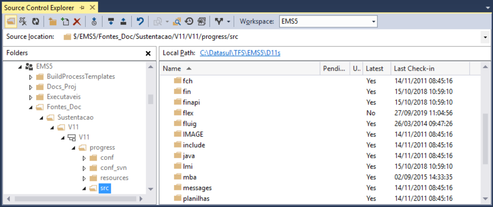

fch     - Fachada (THF1)
fin      - PRÉ-API-REST (PO-UI)
finapi - API-REST (PO-UI)

## Slide 48

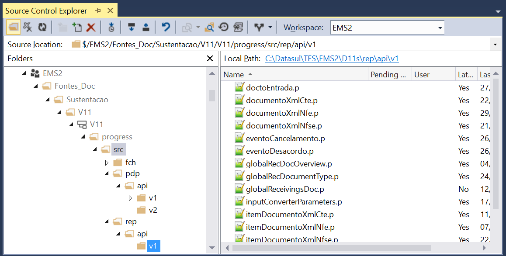

MANUTENÇÃO/EXPEDIÇÃO - BACKEND

TFS: $/EMS2/Fontes_Doc/Sustentacao/V11/V11/progress/src

Programas:

fch - Fachada (THF1)

pdp/api/v1- PRÉ-API-REST (PO-UI)

rep/api/v1- PRÉ-API-REST (PO-UI)

API-REST (PO-UI)
- Verificar execução dentro da PRÉ-API-REST

## Slide 49

04

Ferramentas

## Slide 50

FERRAMENTAS

F12 - Developer Tools - Console:

Posição:
Dock side

Console

Apresenta os erros + Logs

Limpa o Log

## Slide 51

FERRAMENTAS

F12 - Developer Tools - Network:

Detalhes Requisição

Network

Apresenta as Requisições

## Slide 52

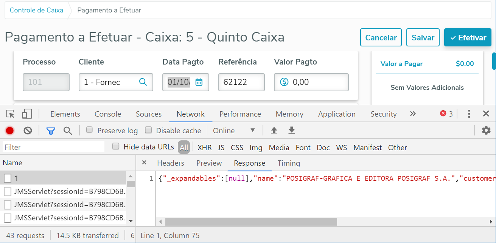

FERRAMENTAS

F12 - Developer Tools - Network:

Network

Apresenta as Requisições

Limpa o Log

Resposta da Requisição

## Slide 53

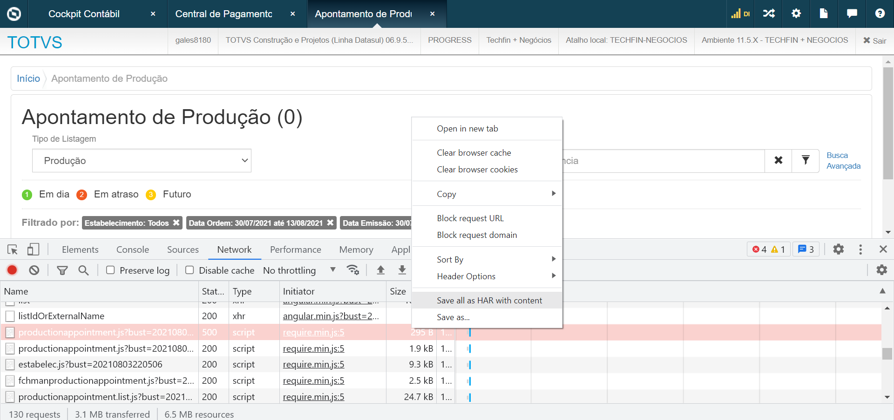

FERRAMENTAS

HAR ANALYZER:

Exportação das Requisições

## Slide 54

FERRAMENTAS

HAR ANALYZER:

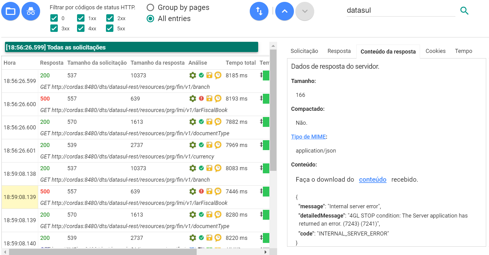

Requisições

Visualização

Filtro

Retorno

Erro

Filtro por Código de Resposta

Acesso: https://toolbox.googleapps.com/apps/har_analyzer/

## Slide 55

FERRAMENTAS

DTS-REST-UI:

fin/api/v1/customer.p

Principais Características: 
Simula Requisição;
Mesma execução realizada pelo FrameWork;
Full Progress;
Execução na máquina local;
Controle de Transação;
Não é necessário alterar nada na API-REST;
Utilizado para Desenv, Manuteção e Suporte.

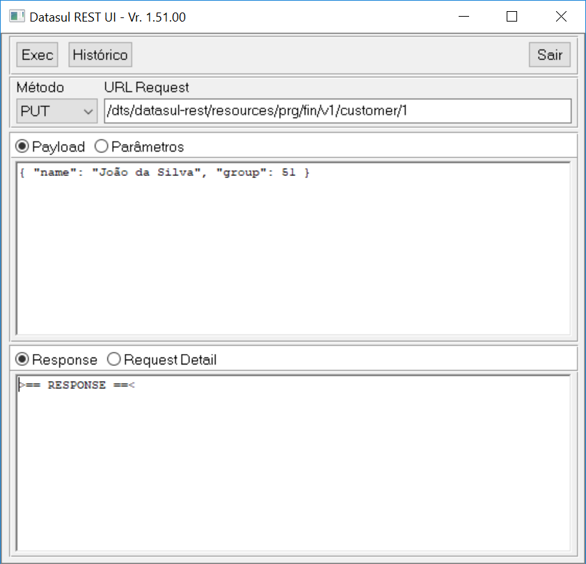

Disponível em: \\enseada\desems5\Atalhos\dts-rest-ui\dts-rest-ui.p

## Slide 56

05

Dicas

## Slide 57

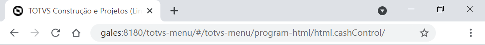

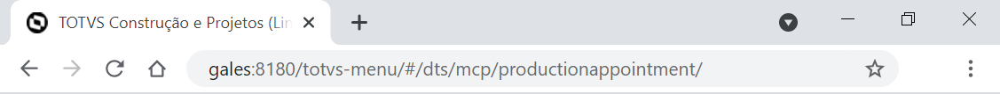

DICAS

Diferenciando THF1 x PO-UI

Como saber se a tela é THF1 ou PO-UI ?

THF1: dts + módulo + programa (menu)

PO-UI: totvs-menu + program-html + programa (menu)

## Slide 58

DICAS

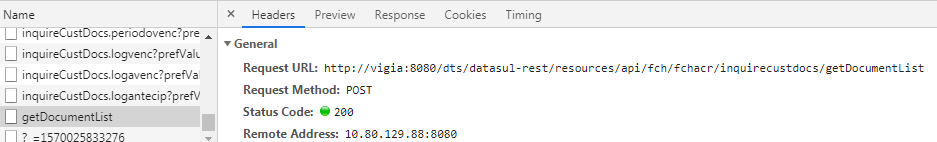

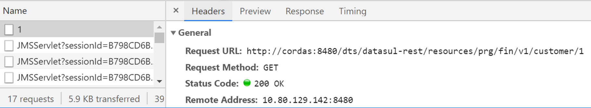

Diferenciando THF1 x PO-UI

Como saber a requisição é THF1 ou PO-UI ?

THF1: api + fch + módulo + programa

PO-UI: prg + área + versão + programa

## Slide 59

DICAS

Versão do Projeto HTML

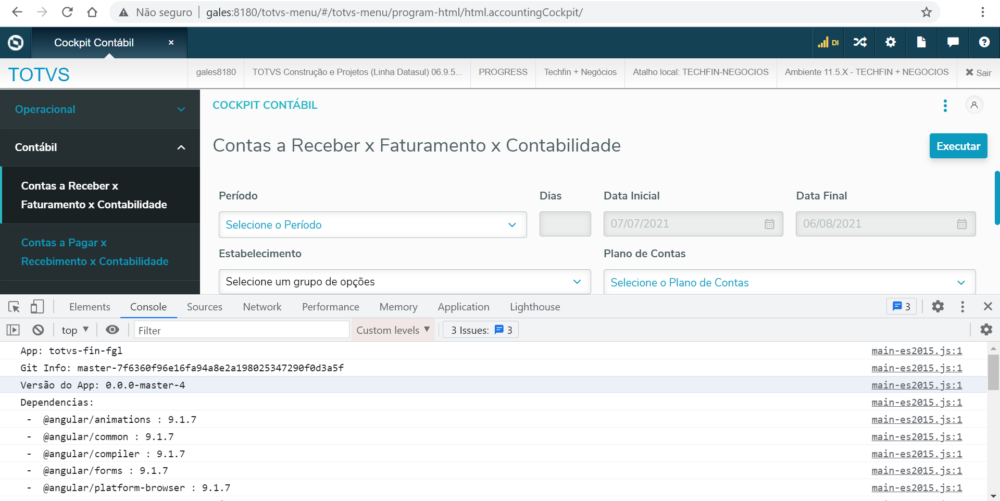

É apresentado no carregamento do Projeto;
Restrição: 
Somente para Projetos que estão no novo modelo Devops;
Veremos a possibilidade de incluir no modelo atual.
Lembrete:
De forma geral, a versão do projeto é a “versão da release do produto”;
Levar em considerações os Paths de Liberação;
Mas, pode ter uma liberação “pontual” pela equipe responsável.

Projeto

Versão

## Slide 60

DICAS

Versão da API-REST

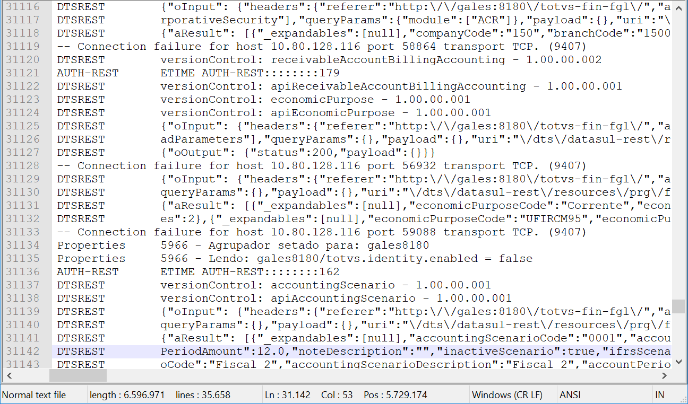

Versão

Restrição: 
Implementação específica, realizada pelo Backoffice;
Foi implementado somente no EMS5.
Alternativa: 
As API-REST do EMS2 executam a include padrão de versionamento;
Portanto é possível consultar o “.r”

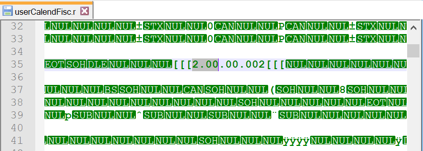

## Slide 61

DICAS

Diretório Temporários para Simulação - Ambientes Internos

Para alguns ambientes, o GCAD disponibiliza um diretório temporário que está no Propath do AppServer;
Estes diretórios ficam no propath na frente do diretório oficial de expedição;
Desta forma, é possível realizar alterações nas API-REST’s, que são executadas a partir das telas HTML;
O conteúdo deles é eliminado todos dias a noite;
Como está no servidor, todos os usuários "enxergam" o programa;
Estes diretórios não afetam execuções locais (na máquina do próprio usuário).

## Slide 62

DICAS

Diretório Temporários para Simulação - Ambientes Internos

Exemplos:

gales:8180 (Teste Integrado - Progress)
     \\arpoador\tst-prgs-psc115x-nfrw\

vigia:8480 (Teste Integrado - SQL)
     \\arpoador\tst-prgs-sql-115x\

Os diretórios estão documentados na página de Ambientes:
     https://tdn.totvs.com/pages/viewpage.action?pageId=183730513

## Slide 63

DICAS

Lembretes

O progress roda no Servidor (não tem propath local);
Não tem extrato de versão;
Não tem Client Log;
Log do AppServer (configuração do nível do Log).

## Slide 64

06

Análise de Erros

## Slide 65

ANÁLISE DE ERROS

Navegadores Homologados:

Cloud TOTVS

Mais Estável

## Slide 66

ANÁLISE DE ERROS

200
404
400
500

Requisição - Principais Códigos de Resposta:

OK
Not Found (Não encontrado) = Informação não Encontrada
Bad Request (Solicitação Inválida) = Erro Interno “Tratado” ou de Negócio
Internal Server Error (Erro Interno do Servidor) = Erro Interno Desconhecido 

## Slide 67

ANÁLISE DE ERROS

Requisição - Código de Resposta: 200 (OK)

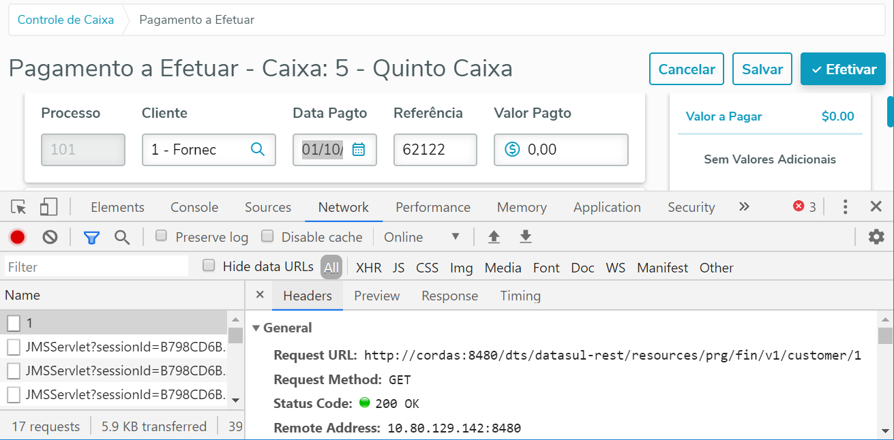

Informado o cliente 1 (Existente)

Status Code: 200

Serviço: customer
Código: 1

## Slide 68

ANÁLISE DE ERROS

Requisição - Código de Resposta: 404 (Not Found)

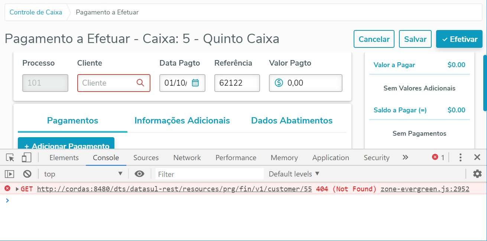

Informado o cliente 55 (Inexistente)

Status Code: 404

Serviço: customer
Código: 55

## Slide 69

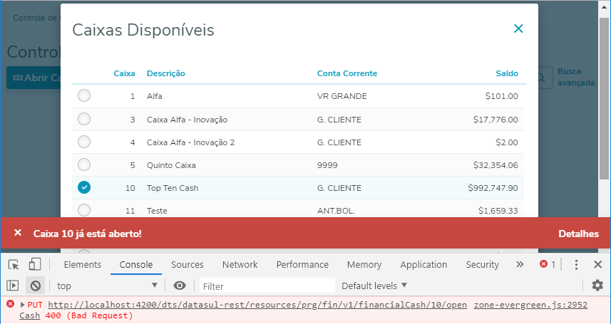

ANÁLISE DE ERROS

Requisição - Código de Resposta: 400 (Bad Request)

Status Code: 400

Serviço: financialCash

Mensagem para o Usuário

## Slide 70

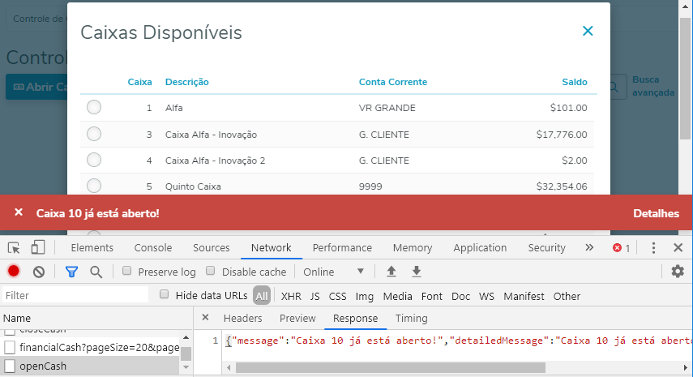

ANÁLISE DE ERROS

Requisição - Código de Resposta: 400 (Bad Request)

Requisição

Retorno da Requisição

## Slide 71

ANÁLISE DE ERROS

Requisição - Código de Resposta: 500 (Internal Error) - Com Descrição

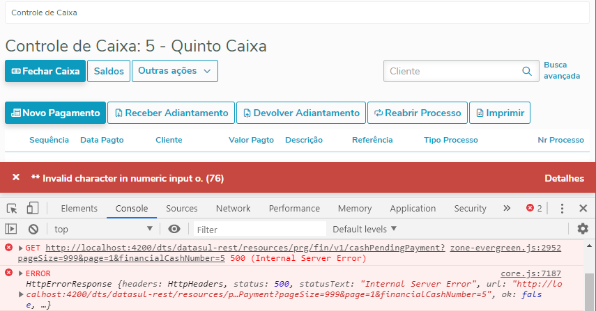

Status Code: 500

Mensagem para o Usuário

Serviço: cashPendingPayment

## Slide 72

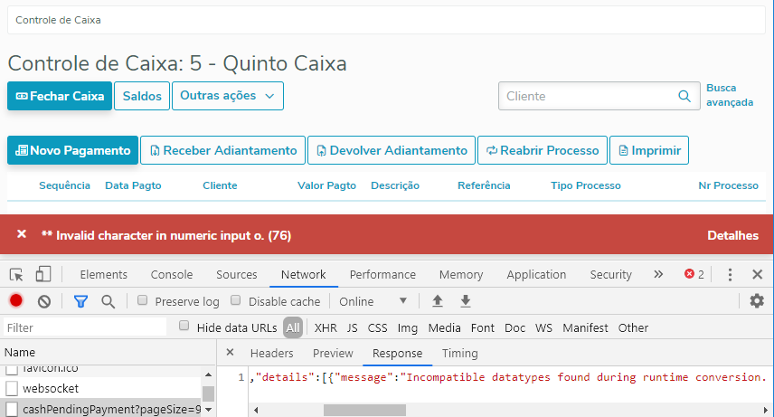

ANÁLISE DE ERROS

Requisição - Código de Resposta: 500 (Internal Error) - Com Descrição

Mas detalhes
Retorno Requisição

## Slide 73

ANÁLISE DE ERROS

Requisição - Código de Resposta: 500 (Internal Error) - Com Descrição

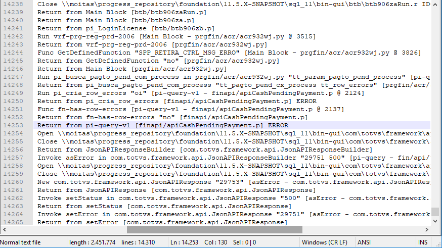

Procurar pelo Serviço

Não está tão claro o erro

Geração do Status 500

Mas sei o local

## Slide 74

ANÁLISE DE ERROS

Requisição - Código de Resposta: 500 (Internal Error) - Sem Descrição

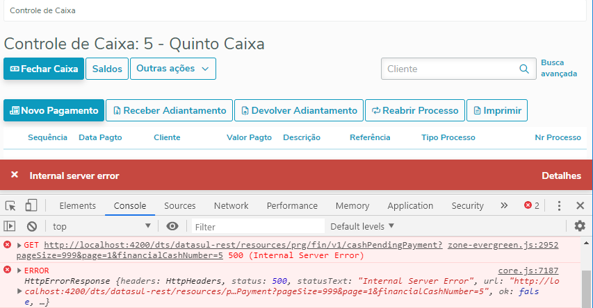

Status Code: 500

Mensagem Genérica

## Slide 75

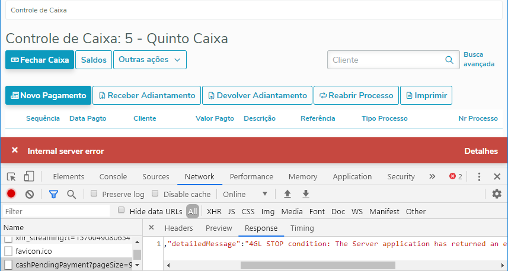

ANÁLISE DE ERROS

Requisição - Código de Resposta: 500 (Internal Error) - Sem Descrição

Detalhe: 4GL STOP condition

## Slide 76

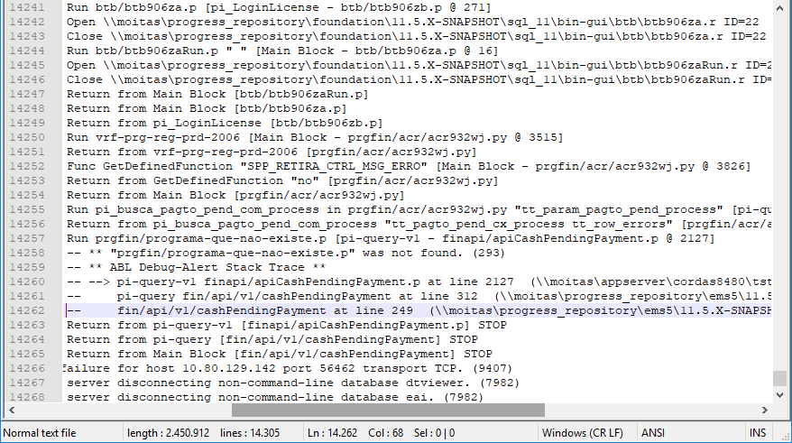

ANÁLISE DE ERROS

Requisição - Código de Resposta: 500 (Internal Error) - Sem Descrição

O Erro está mais claro

## Slide 77

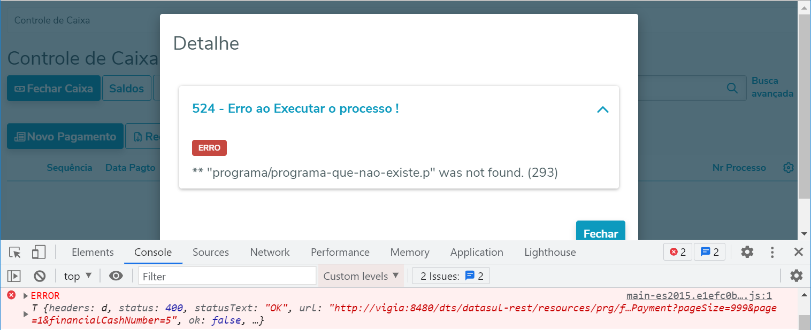

ANÁLISE DE ERROS

Requisição - Código de Resposta: 500 (Internal Error) - Controle de Error - API-REST

Erro “tratado”

Status Code: 400

## Slide 78

ANÁLISE DE ERROS

Erro no HTML (Camada de Controle)

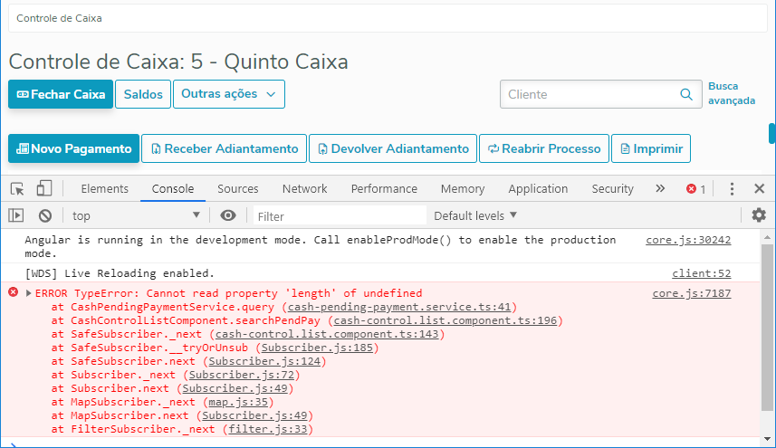

Erro

Arquivo de Controle

## Slide 79

ANÁLISE DE ERROS

Erro de conversão UTF-8

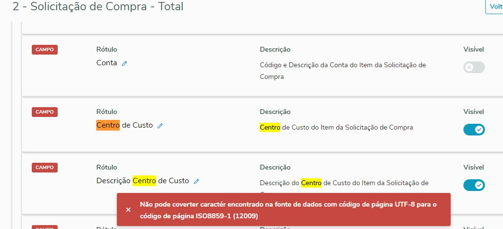

Erro retornado do BackEnd

Causa: 
O usuário copiou o texto de algum lugar;
Este texto possuir um caracter não reconhecido pelo progress;
Por exemplo o caracter “...” do Word.
Ação:
Transferir o Ticket para o Framework;
Antes de chamar o progress é feito uma tratativa para retirar estes caracteres;
Ela é por demanda, conforme aparecem os caracteres inválidos.

## Slide 80

OBRIGADO

adriano.avila@totvs.com.br

ADRIANO DE AVILA

